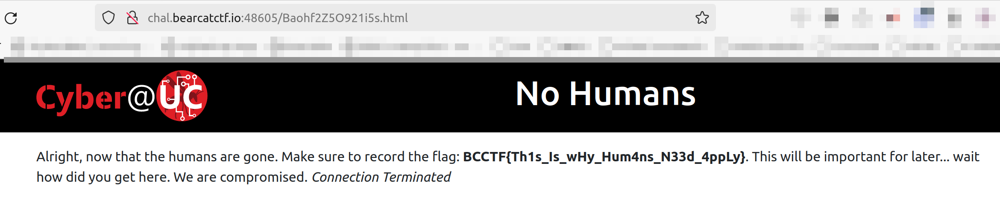

Challenge info:

No Humans

My robot is making secret plans. Unfortunately I was given strict plans not to show up. Find out what they are planning.<br>
http://chal.bearcatctf.io:48605/ 

Solve Steps:

1. Going to the webpage we are met with a "NO HUMANS" message:<br>
NO HUMANS<br>
Super Secret Robot Stuff<br>
You have fallen for my trap and are stuck in the human zone. My site is now closed to you.<br>
And because you humans are not great at poking around, I added a user-agent to my ruleset for the other robots. Do not enter the forbidden sites at your own risk<br>


2. Since the task talks about "my ruleset for the other robots" I took a look at: http://chal.bearcatctf.io:48605/robots.txt<br>
The robots.txt file is filled with fun. I copied all of the info into a text document and removed everything except the url-endpoints.
This would be my wordlist for testing. I also took note of the different "user-agents":
```
Overlords
Enforcers
Humans
HumanRebels
AttackDrones
*
```


3. Next I turned to **WFUZZ:**
```
# BF through all url-endpoints, setting custom "User-Agent" and filtering for 200 responses
wfuzz -c -z file,BearCTF_NoHumans.txt --sc 200 -H "User-Agent: Overlords"  "http://chal.bearcatctf.io:48605/FUZZ"

# output:
=====================================================================
ID           Response   Lines    Word       Chars       Payload                                                                                         
=====================================================================

000001488:   200        25 L     85 W       1129 Ch     "Baohf2Z5O921i5s.html"
```

4. Next step was to send a request with **CURL** to the endpoint that gave the 200 response:
```
# Send request with curl setting custom "User-Agent"
curl -H "user-agent: Overlords" http://chal.bearcatctf.io:48605/Baohf2Z5O921i5s.html

# output:
#output ommited#
<div class="container">
    <div class="row">
        <p>Alright, now that the humans are gone. Make sure to record the flag: <b>BCCTF{Th1s_Is_wHy_Hum4ns_N33d_4ppLy}</b>. This will be important for later... wait how did you get here. We are compromised. <i>Connection Terminated</i></p>
    </div>
</div>
#output ommited#

```

5. flag: **BCCTF{Th1s_Is_wHy_Hum4ns_N33d_4ppLy}**

6. Note: I tried pasting the endpoint-url directly in the browser and recieved the flag even without setting a custom "User-Agent":

